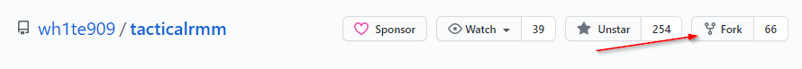
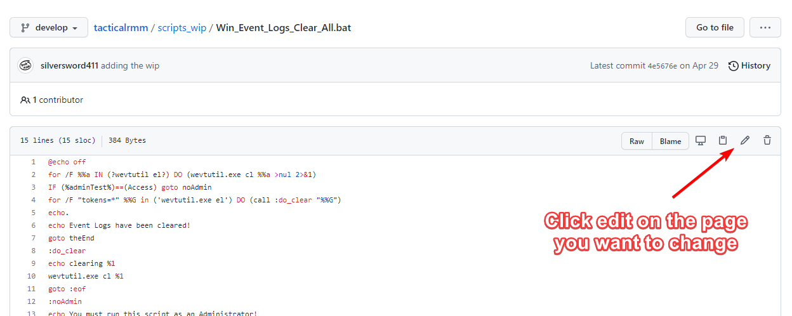
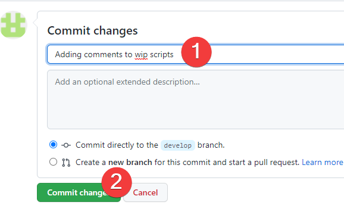

# Contributing Using Web Browser

## Getting Started

### 1. Fork Project in Github

This is making a duplicate of the code under your Github that you can edit

<https://github.com/gueencode/gueenrmm>

### 2. Make Edits

Make some changes

### 3. Request your changes to be pulled into the primary repo (Pull Request)

This is taking your changes and requesting they be integrated into the Gueen RMM develop branch.

#### 3a. Check the status of your PR

Look at a summary of the changes you've requested, monitor for them to be accepted, or commented on.

<https://github.com/gueencode/gueenrmm/pulls>

Once they're accepted you can either:
* Delete your fork
* Sync your local fork

#### 4. Sync your fork

<https://docs.github.com/en/github/collaborating-with-issues-and-pull-requests/syncing-a-fork>

Bring changes from original repo to your fork so you're current with changes made in original Github repo

#### 5. Lather, Rinse, Repeat

Goto Step 2. and contribute some more

## Notes

After your changes are accepted, they won't be live in Gueen RMM until there is a new [release](https://github.com/gueencode/gueenrmm/releases). #BePatient
